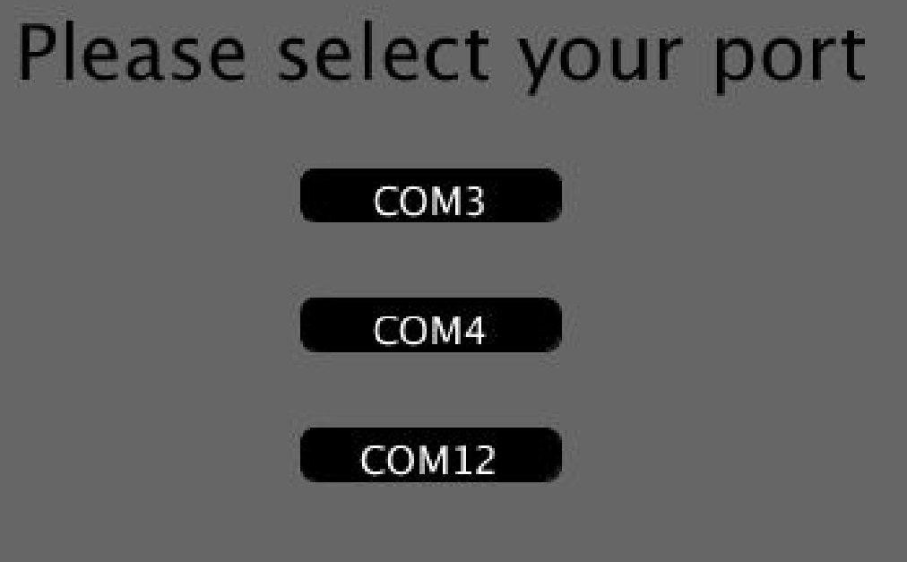
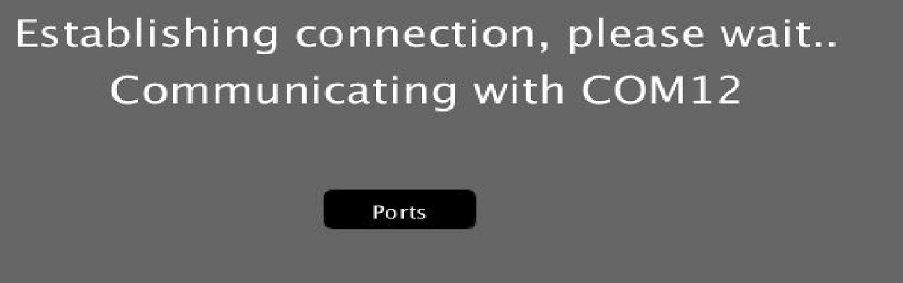
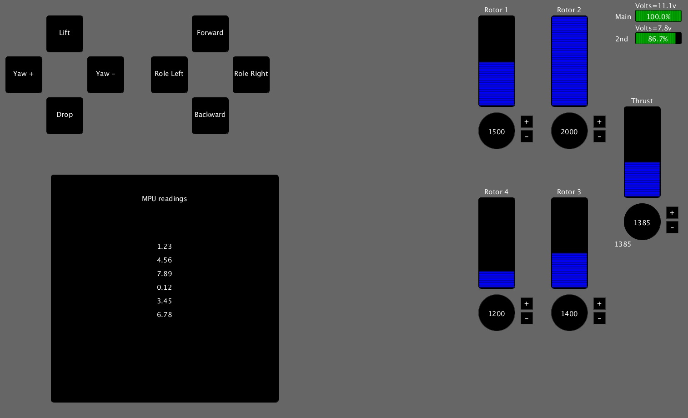

# Quadcopter RC Interface (Transmitter)

## Table of contents
* [General info](#general-info)
* [Technology](#technology)
* [To-Do](#to-do)
* [Transmitter](#transmitter)

## General info
This is Remote controller interface module for Quadcopter.

## Technology
Project is created with:
* Processing

## To-Do
##### 1. Select Com port

##### 2. Establish the connection with over the Com port

##### 3. Basic Interface View

##### 4. <b>Working Interface View

## Transmitter
1. Global Variables
2. Constructor for ControlButtons Class
3. Variables & Constructors:
  1. ControlButtons Class
  2. Thrust Class
  3. Battery Class
  4. MPU Class
4. setup() & draw()
5. serialEvent() & movement()
6. BaseShape class - <b>Basic most class that deals with drawing and button</b>
7. ControlButtons Class - <b>Class that deals with drawing and clicking of buttons</b>
8. Thrust Class - <b>Class that deals how the Thrust value should be displayed</b>
9. Battery Class - <b>Class that deals how the Battery value should be displayed</b>
10. MPU Class - <b>Class that deals how the MPU value should be displayed</b>
